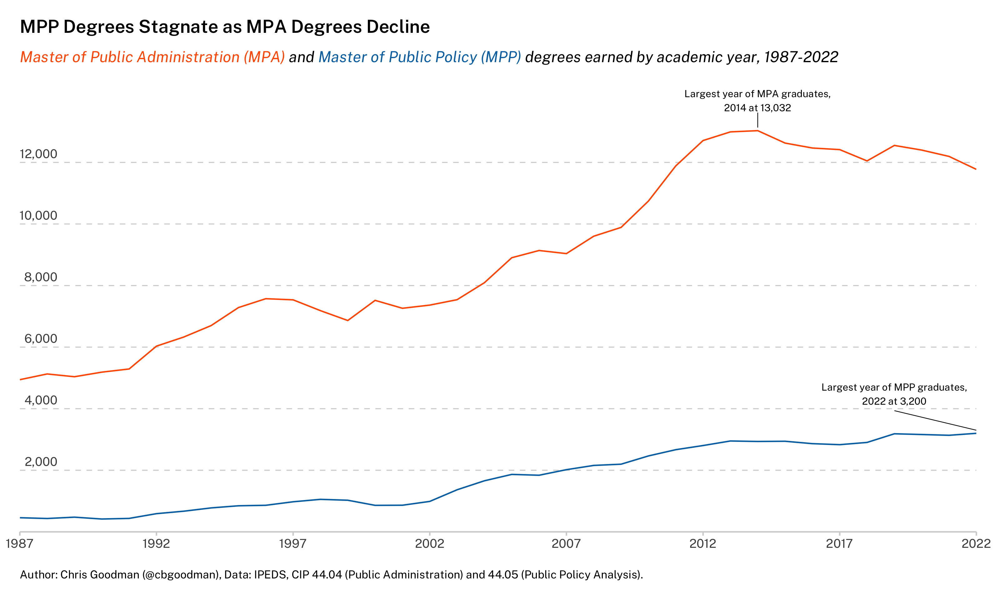
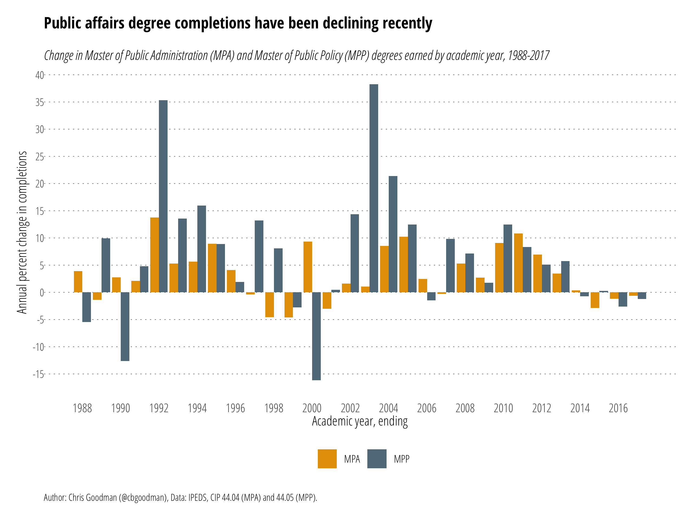

# Earned Graduate Degrees in Public Affairs

The **R** script `ipeds-pa.r` reads `data.csv` to create the images below of earned graduate degrees in public affairs from academic year ending 1987 to 2017. The data are from [IPEDS Data Center](https://nces.ed.gov/ipeds/use-the-data).

## Data
The data are sourced from the IPEDS database using the "Title IV and U.S. service institutions (NCES publications)" group.

